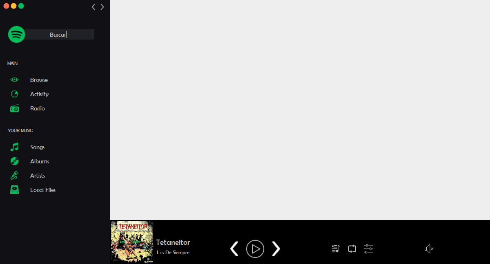

# Actividad 6

Realizamos la incorporación de componentes gráficos sobre la ventana principal de sus proyectos y realizamos enrutamiento de tal forma que se controle la creación de objetos en memoria de los componentes.

Login

Vista principal

Browse

Activity

Radio

Songs

Albums

Artists

Local Files

